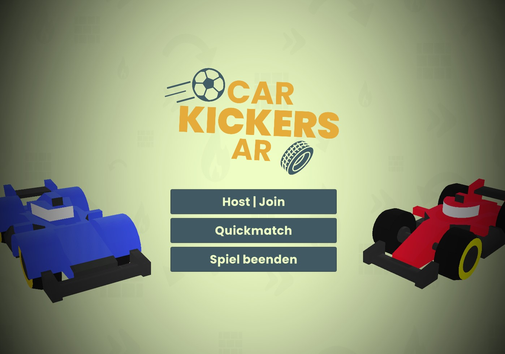

# Car Kickers AR
In this multiplayer game, 2 against 2 players compete against each other
by using small cars to shoot the ball into the opponent's goal.
The soccer field and the other objects are placed in reality. 
There are also bombs on the field that you should stay away from!
 
* **Genre:** AR Multiplayer Game
* **Plattform:** Android and IOS

 
 

# Tools

| Software / Package                | Description / Link                                                                                  |
| --------------------------        | ------------------------------------------------------------------------------------- |
| Unity3D 2022.3.11 (LTS)           | https://unity3d.com/get-unity/download/archive                                        |
| AR Foundation    | https://unity.com/de/unity/features/arfoundation                                       |
| Asset Forge                   | https://kenney.nl/tools/asset-forge                                                     |
| Photon Engine    | https://www.photonengine.com/                                       |

 
 

# Gameplay Video
Check out the gameplay video of Car Kickers AR on Vimeo:
 

 
 

# Story
In a futuristic world where sports have evolved beyond the stadium, you and your team take part in a high-stakes augmented reality soccer match. Armed with high-powered remote-controlled cars, your objective is simple: outmaneuver your opponents, kick the ball into their goal, and avoid the explosive traps scattered across the field. But beware—the bombs can change the tide of the game in an instant! Only the most skillful drivers will rise to victory and claim the title of AR Soccer Champions.

 
 

# Controls
* Movement: Use the joystick in the UI overlay
* Boost: Tap the Boost button on the screen to temporarily increase your car's speed.
* Kick the Ball: Use swipe gestures to aim and kick the ball toward the goal.
* Bomb Avoidance: Navigate around bombs by using precise control of your car’s movements to avoid getting blown up.

# Features

## Play everywhere
Car Kickers AR leverages augmented reality, allowing you to place the soccer field in any real-world environment. Whether you're in your living room, backyard, or even at the park, the game adapts to the space around you. Thanks to the AR integration, you and your friends can turn any space into a high-energy soccer arena.

Adaptable AR Gameplay: Place your soccer field on any flat surface.
Real-World Interaction: Navigate the game as if the field and cars are really in front of you.
Multiplayer Fun: Play with friends in real-time 2v2 matches.

 

## Unity AR Integration
Car Kickers AR is built using Unity's AR Foundation and leverages ARCore (Android) and ARKit (iOS) to create a seamless AR experience across platforms. The Unity engine handles all the physics, networking (using Photon for multiplayer support), and AR elements that make the gameplay dynamic and immersive.

Cross-Platform AR Support: Works seamlessly on both Android (ARCore) and iOS (ARKit).
Photon Networking: Real-time multiplayer action with low-latency communication between players.
AR Foundation: Ensures stability and smooth AR experience across different devices.
Interactive Environments: Cars, goals, and bombs react to real-world surfaces and obstacles.

# License
[MIT](https://choosealicense.com/licenses/mit/)
